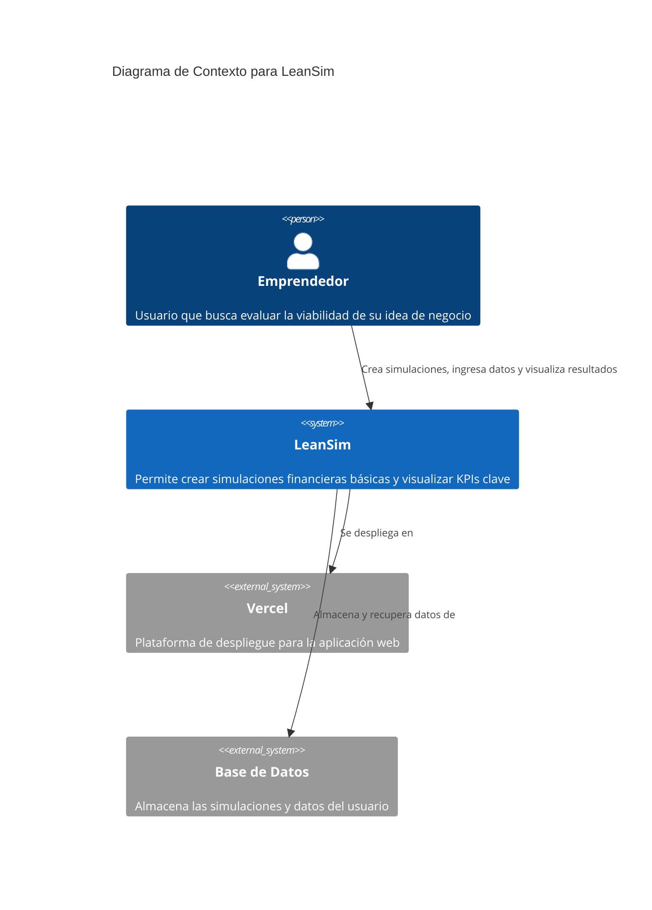
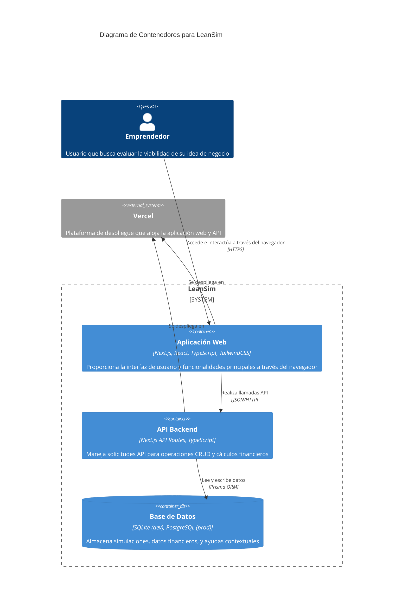
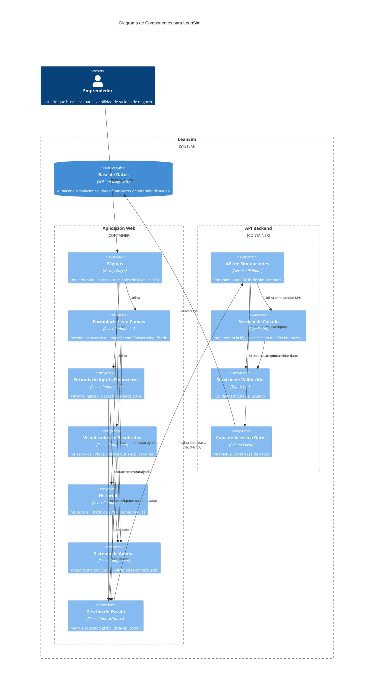

# Diagrama C4 para LeanSim

## Descripción

Este documento contiene los diagramas del modelo C4 para la aplicación LeanSim, presentados en cuatro niveles de abstracción: Contexto, Contenedores, Componentes y Código. Estos diagramas proporcionan una visión progresivamente más detallada del sistema, desde una perspectiva general hasta los componentes específicos.

## Decisiones de Diseño

- Se ha seguido estrictamente la notación C4 para mantener la claridad y consistencia.
- Los diagramas se centran en la arquitectura del MVP, sin incluir componentes futuros.
- Se mantiene la simplicidad apropiada para un MVP, evitando la sobreingeniería.
- Se han incluido los cuatro niveles de C4, con énfasis en los tres primeros que son los más relevantes para esta fase.

## Diagrama de Contexto (Nivel 1)



## Diagrama de Contenedores (Nivel 2)



## Diagrama de Componentes (Nivel 3)



## Diagrama de Código (Nivel 4)

Para el MVP, presentaremos un diagrama de código simplificado centrado en el componente de cálculo financiero, que es crítico para la aplicación:

```mermaid
C4Code
    title Diagrama de Código para el Componente de Cálculo Financiero

    Boundary(calculationService, "Servicio de Cálculo Financiero") {
        Class(financialCalculator, "FinancialCalculator", "class") {
            + calculateProfit(data: FinancialData): number
            + calculateBreakEven(data: FinancialData): number
            + calculateLTV(data: FinancialData): number
            + calculateLTVCAC(data: FinancialData): number
            + calculateMargin(data: FinancialData): number
            + calculateAllKPIs(data: FinancialData): KPIResults
        }

        Class(kpiUtils, "KPIUtils", "class") {
            + formatCurrency(value: number): string
            + getKPIStatus(kpi: string, value: number): 'good' | 'medium' | 'bad'
            + getKPIDescription(kpi: string): string
        }

        Class(kpiInterface, "Interfaces", "interface") {
            + FinancialData
            + KPIResults
            + KPIStatus
        }
    }

    Rel(financialCalculator, kpiUtils, "Utiliza")
    Rel(financialCalculator, kpiInterface, "Implementa")
    Rel(kpiUtils, kpiInterface, "Utiliza")
```

## Elementos Principales

### Nivel 1: Contexto

- **Emprendedor**: Usuario principal del sistema. Persona sin conocimientos técnicos financieros que busca evaluar la viabilidad de su idea de negocio de manera rápida e intuitiva. Interactúa con la aplicación para crear simulaciones financieras, completar el Lean Canvas simplificado y obtener KPIs de viabilidad.

- **LeanSim**: El sistema en su conjunto. Plataforma web que combina formularios intuitivos para capturar información estratégica y financiera, y que proporciona automáticamente análisis de viabilidad mediante el cálculo de KPIs clave. Incluye funcionalidades educativas mediante ayudas contextuales para guiar al usuario sin experiencia.

- **Vercel**: Plataforma externa para el despliegue. Proporciona la infraestructura completa para hospedar la aplicación, incluyendo CDN global, Edge Network para optimización de rendimiento, y capacidades de CI/CD para despliegue continuo. Se encarga del escalado automático y la distribución global del contenido.

- **Base de Datos**: Sistema externo para almacenamiento de datos. En producción, se utiliza PostgreSQL alojado en un servicio externo y conectado a través de Prisma ORM. Almacena todas las simulaciones, datos financieros, contenido de Lean Canvas y ayudas contextuales.

### Nivel 2: Contenedores

- **Aplicación Web**: Front-end construido con Next.js y React. Implementa la interfaz de usuario completa, utilizando componentes React organizados por funcionalidad, y aprovecha las capacidades de renderizado del lado del servidor (SSR) de Next.js para mejorar el rendimiento y el SEO. Utiliza TailwindCSS para el diseño visual y ReactHookForm para la gestión de formularios.

- **API Backend**: Back-end implementado con API Routes de Next.js. Proporciona endpoints para todas las operaciones CRUD relacionadas con simulaciones, procesamiento de datos financieros y cálculos de KPIs. La lógica de negocio está encapsulada en servicios separados que son consumidos por estas rutas API. Se ejecuta como parte del mismo proyecto Next.js, simplificando la arquitectura.

- **Base de Datos**: SQLite para desarrollo y PostgreSQL para producción. La base de datos almacena todas las entidades del sistema (Simulation, LeanCanvas, FinancialData, ContextualHelp) con sus relaciones. El acceso a datos está abstraído mediante Prisma ORM, permitiendo un cambio transparente entre SQLite en desarrollo y PostgreSQL en producción.

### Nivel 3: Componentes

- **Componentes de UI**:

  - **Páginas (Pages)**: Componentes de nivel superior que definen las rutas de la aplicación. Gestionan la composición general de cada vista y el flujo de navegación.
  - **Formulario Lean Canvas**: Componente especializado para capturar los 5 campos clave del Lean Canvas simplificado, con validación integrada y ayudas contextuales.
  - **Formulario de Inputs Financieros**: Componente para la entrada de datos financieros con validación en tiempo real, tooltips explicativos y formateo automático.
  - **Visualizador de Resultados**: Componente que muestra los KPIs calculados con representaciones visuales, codificación por colores e información contextual.
  - **Historial de Simulaciones**: Componente que lista las simulaciones previas, permitiendo cargarlas o eliminarlas.
  - **Componentes UI Base**: Biblioteca de componentes reutilizables como botones, inputs, tarjetas y modales que mantienen una experiencia consistente.

- **Gestión de Estado**:

  - **Context Providers**: Implementan el patrón de Context API de React para proporcionar estado global a diferentes partes de la aplicación.
  - **Custom Hooks**: Encapsulan lógica reutilizable para gestionar efectos secundarios, llamadas a API y manipulación de estado local.
  - **Form State Management**: Utiliza React Hook Form para la gestión eficiente del estado de formularios complejos, validación y manejo de errores.

- **APIs y Servicios**:
  - **API de Simulaciones**: Endpoints para crear, recuperar, actualizar y eliminar simulaciones completas.
  - **Servicio de Cálculo Financiero**: Implementa los algoritmos y fórmulas para calcular todos los KPIs financieros basados en los inputs del usuario.
  - **Servicio de Validación**: Valida todos los inputs del usuario según reglas de negocio específicas antes de procesarlos.
  - **Acceso a Datos**: Capa que abstrae las operaciones de base de datos mediante Prisma Client, implementando el patrón repositorio.
  - **Sistema de Ayudas Contextuales**: Servicio que gestiona y proporciona contenido educativo contextual para cada campo y concepto.

### Nivel 4: Código

- **FinancialCalculator**: Clase principal para cálculos financieros. Implementa métodos específicos para cada KPI (calcularBeneficioMensual, calcularPuntoEquilibrio, calcularLTV, calcularRelacionLTVCAC, calcularMargenPorCliente) utilizando fórmulas financieras estándar adaptadas para emprendedores sin experiencia.

- **KPIUtils**: Utilidades para formateo y evaluación de KPIs. Incluye funciones para formatear valores monetarios según la configuración regional, evaluar la salud de un KPI (bueno/medio/malo), y generar mensajes explicativos basados en los valores obtenidos.

- **Interfaces**: Definiciones de tipos para datos financieros y resultados. Define estructuras de datos TypeScript para todos los modelos (ISimulation, ILeanCanvas, IFinancialData, IContextualHelp, ICalculatedKPIs) asegurando tipado estático y seguridad en toda la aplicación.

- **Prisma Schema**: Define el modelo de datos para la base de datos, incluyendo todas las entidades, relaciones, campos y restricciones, sirviendo como fuente única de verdad para la estructura de datos.

- **API Routes**: Implementaciones de los endpoints API como funciones serverless en Next.js, que manejan requests HTTP, procesan datos, interactúan con servicios y devuelven respuestas JSON.

## Consideraciones Adicionales

- Los diagramas están diseñados para ser implementables directamente con las tecnologías especificadas (Next.js, Prisma, etc.).
- El nivel de detalle aumenta progresivamente, manteniendo la coherencia entre los diferentes niveles.
- La arquitectura propuesta es adaptable a futuras extensiones como autenticación de usuarios, exportación de datos, o integración de IA.
- Se ha priorizado la claridad y la simplicidad sobre la exhaustividad, de acuerdo con los principios de desarrollo de MVP.
- Los componentes están organizados siguiendo buenas prácticas de separación de responsabilidades.
