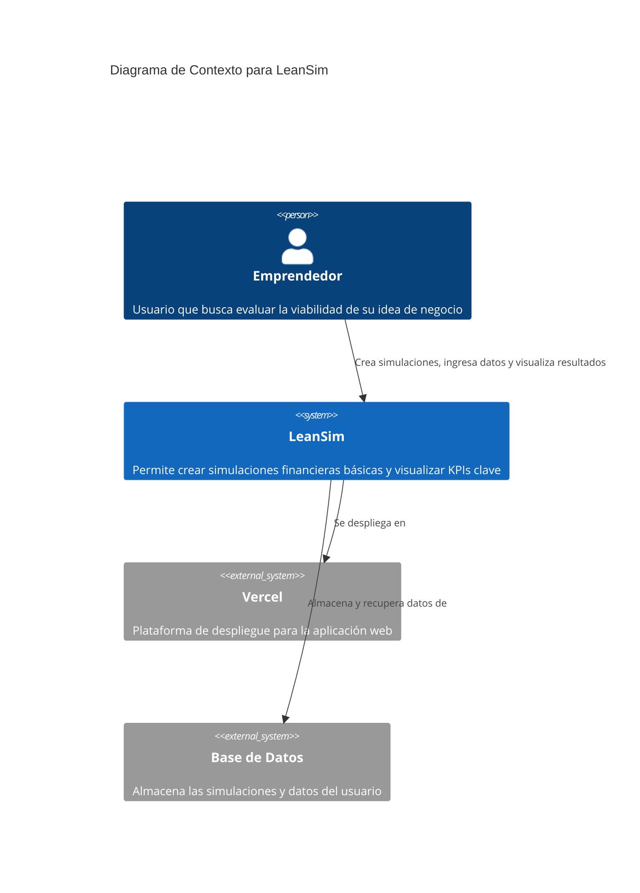
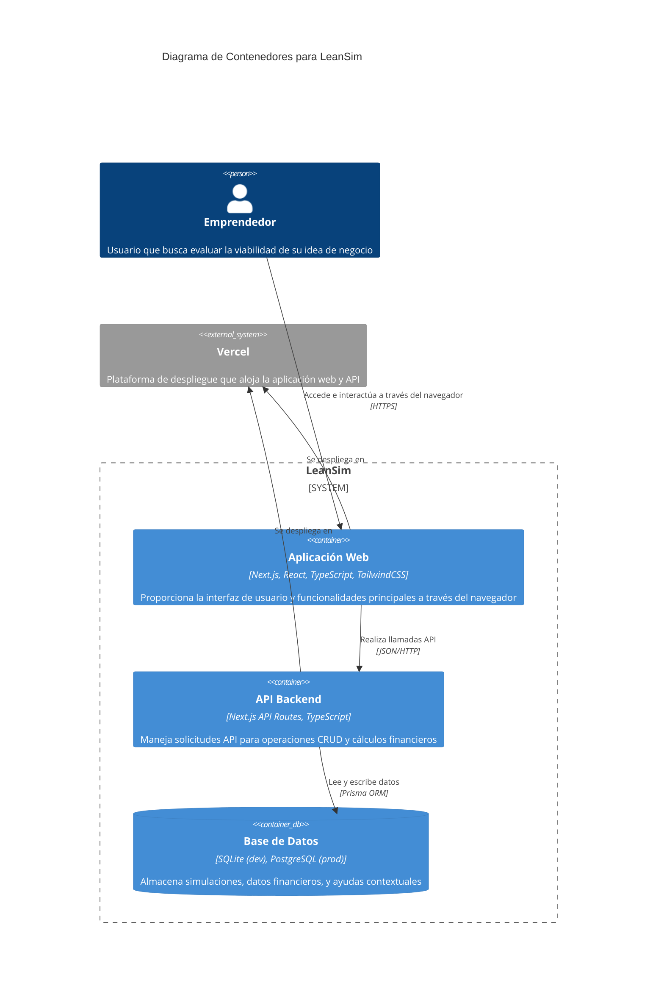
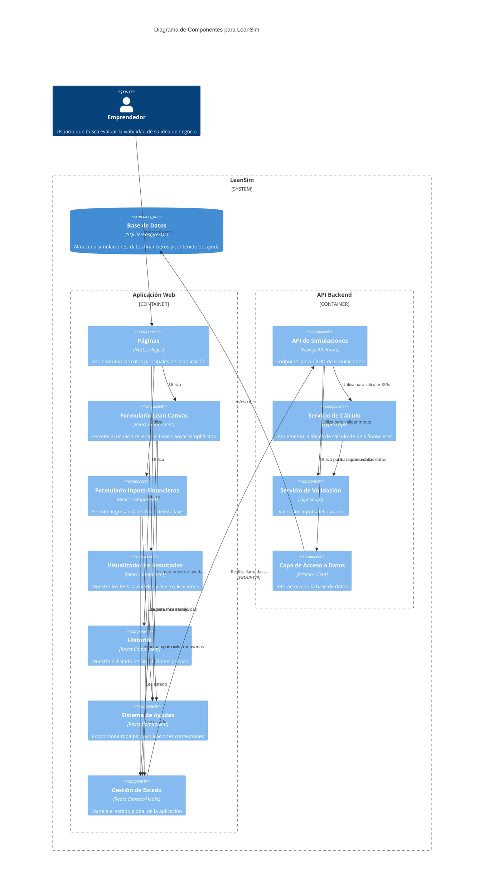

# Diagrama C4 para LeanSim

## Descripción

Este documento contiene los diagramas del modelo C4 para la aplicación LeanSim, presentados en cuatro niveles de abstracción: Contexto, Contenedores, Componentes y Código. Estos diagramas proporcionan una visión progresivamente más detallada del sistema, desde una perspectiva general hasta los componentes específicos.

## Decisiones de Diseño

- Se ha seguido estrictamente la notación C4 para mantener la claridad y consistencia.
- Los diagramas se centran en la arquitectura del MVP, sin incluir componentes futuros.
- Se mantiene la simplicidad apropiada para un MVP, evitando la sobreingeniería.
- Se han incluido los cuatro niveles de C4, con énfasis en los tres primeros que son los más relevantes para esta fase.

## Diagrama de Contexto (Nivel 1)



## Diagrama de Contenedores (Nivel 2)



## Diagrama de Componentes (Nivel 3)



## Diagrama de Código (Nivel 4)

Para el MVP, presentaremos un diagrama de código simplificado centrado en el componente de cálculo financiero, que es crítico para la aplicación:

```mermaid
C4Code
    title Diagrama de Código para el Componente de Cálculo Financiero

    Boundary(calculationService, "Servicio de Cálculo Financiero") {
        Class(financialCalculator, "FinancialCalculator", "class") {
            + calculateProfit(data: FinancialData): number
            + calculateBreakEven(data: FinancialData): number
            + calculateLTV(data: FinancialData): number
            + calculateLTVCAC(data: FinancialData): number
            + calculateMargin(data: FinancialData): number
            + calculateAllKPIs(data: FinancialData): KPIResults
        }

        Class(kpiUtils, "KPIUtils", "class") {
            + formatCurrency(value: number): string
            + getKPIStatus(kpi: string, value: number): 'good' | 'medium' | 'bad'
            + getKPIDescription(kpi: string): string
        }

        Class(kpiInterface, "Interfaces", "interface") {
            + FinancialData
            + KPIResults
            + KPIStatus
        }
    }

    Rel(financialCalculator, kpiUtils, "Utiliza")
    Rel(financialCalculator, kpiInterface, "Implementa")
    Rel(kpiUtils, kpiInterface, "Utiliza")
```

## Elementos Principales

### Nivel 1: Contexto

- **Emprendedor**: Usuario principal del sistema.
- **LeanSim**: El sistema en su conjunto.
- **Vercel**: Plataforma externa para el despliegue.
- **Base de Datos**: Sistema externo para almacenamiento de datos.

### Nivel 2: Contenedores

- **Aplicación Web**: Front-end construido con Next.js y React.
- **API Backend**: Back-end implementado con API Routes de Next.js.
- **Base de Datos**: SQLite para desarrollo y PostgreSQL para producción.

### Nivel 3: Componentes

- **Componentes de UI**: Páginas, formularios, visualizadores.
- **Gestión de Estado**: Contexto y hooks de React para manejo de estado.
- **APIs y Servicios**: Endpoints API y servicios de cálculo, validación y acceso a datos.

### Nivel 4: Código

- **FinancialCalculator**: Clase principal para cálculos financieros.
- **KPIUtils**: Utilidades para formateo y evaluación de KPIs.
- **Interfaces**: Definiciones de tipos para datos financieros y resultados.

## Consideraciones Adicionales

- Los diagramas están diseñados para ser implementables directamente con las tecnologías especificadas (Next.js, Prisma, etc.).
- El nivel de detalle aumenta progresivamente, manteniendo la coherencia entre los diferentes niveles.
- La arquitectura propuesta es adaptable a futuras extensiones como autenticación de usuarios, exportación de datos, o integración de IA.
- Se ha priorizado la claridad y la simplicidad sobre la exhaustividad, de acuerdo con los principios de desarrollo de MVP.
- Los componentes están organizados siguiendo buenas prácticas de separación de responsabilidades.
