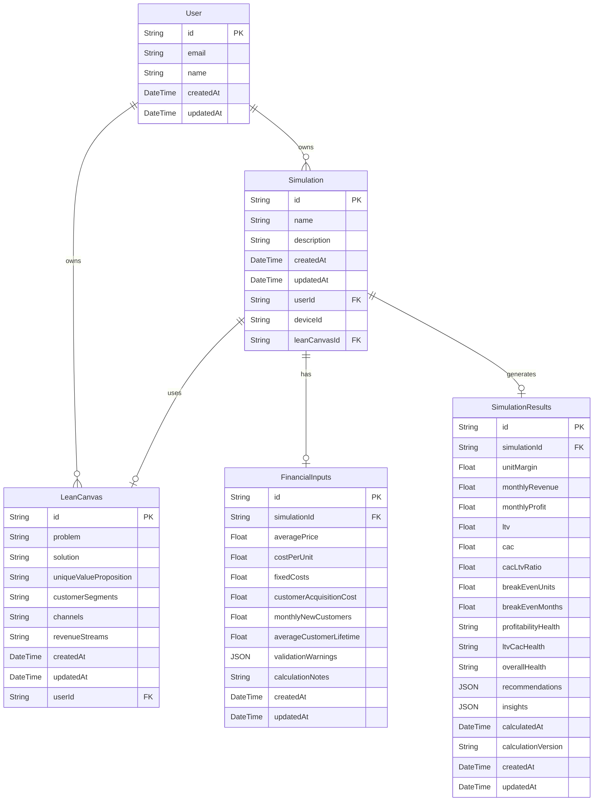

# Modelo de Datos - LeanSim

## Descripción

Este modelo de datos representa las entidades principales de la aplicación LeanSim tras la limpieza y normalización de la arquitectura legacy. El diseño está optimizado para separar claramente los metadatos de simulación, los inputs financieros, y los resultados calculados, eliminando duplicaciones y centralizando la información en las entidades apropiadas para proporcionar una base sólida y mantenible para futuras funcionalidades.

## Decisiones de Diseño

- **Separación de responsabilidades**: Se han separado los datos en entidades especializadas (`Simulation`, `FinancialInputs`, `SimulationResults`, `LeanCanvas`)
- **Eliminación de legacy**: Se han eliminado completamente los campos legacy del modelo `Simulation` para usar exclusivamente tablas normalizadas
- **Centralización de metadatos**: Los campos `name` y `description` se mantienen únicamente en `Simulation`, eliminando duplicación con `LeanCanvas`
- **Soporte multi-usuario**: Se ha añadido soporte para usuarios registrados y anónimos mediante `userId` y `deviceId`
- **Flexibilidad de cálculo**: Los resultados se almacenan con metadatos de versión para permitir evolución de algoritmos
- **Relaciones limpias**: Cada simulación puede tener opcionalmente inputs financieros, resultados y un lean canvas asociado
- **Arquitectura normalizada**: LeanCanvas se enfoca únicamente en contenido de negocio, mientras Simulation maneja metadatos

## Diagrama

## Elementos Principales

### 1. Entidad User

**Descripción:** Representa un usuario registrado en el sistema. Permite gestionar simulaciones de usuarios identificados.

**Atributos:**

- `id` (String): Identificador único del usuario. **Clave primaria**, generado automáticamente usando CUID.
- `email` (String): Dirección de correo electrónico única. **Not null y unique**.
- `name` (String): Nombre del usuario. **Nullable**.
- `createdAt` (DateTime): Fecha y hora de creación. **Not null**, valor por defecto: fecha/hora actual.
- `updatedAt` (DateTime): Fecha y hora de la última actualización. **Not null**, se actualiza automáticamente.

**Relaciones:**

- Relación 1:N con `Simulation` (puede tener múltiples simulaciones)
- Relación 1:N con `LeanCanvas` (puede tener múltiples lean canvas)

### 2. Entidad Simulation

**Descripción:** Contenedor principal que representa una simulación completa. Almacena metadatos centralizados (nombre, descripción) y gestiona las relaciones con otras entidades, manteniendo la arquitectura limpia tras la eliminación de campos legacy y la centralización de metadatos.

**Atributos:**

- `id` (String): Identificador único de la simulación. **Clave primaria**, generado automáticamente usando CUID.
- `name` (String): Nombre de la simulación. **Not null**. Campo centralizado que anteriormente estaba duplicado en LeanCanvas.
- `description` (String): Descripción opcional de la simulación. **Nullable**. Campo centralizado que anteriormente estaba duplicado en LeanCanvas.
- `createdAt` (DateTime): Fecha y hora de creación. **Not null**, valor por defecto: fecha/hora actual.
- `updatedAt` (DateTime): Fecha y hora de la última actualización. **Not null**, se actualiza automáticamente.
- `userId` (String): Identificador del usuario propietario. **Nullable**, para permitir usuarios anónimos.
- `deviceId` (String): Identificador del dispositivo. **Nullable**, para identificar usuarios anónimos.
- `leanCanvasId` (String): Referencia opcional al lean canvas asociado. **Nullable**.

**Relaciones:**

- Relación N:1 con `User` (pertenece a un usuario, opcional)
- Relación 1:1 con `LeanCanvas` (puede usar un lean canvas, opcional)
- Relación 1:1 con `FinancialInputs` (puede tener inputs financieros, opcional)
- Relación 1:1 con `SimulationResults` (puede tener resultados, opcional)

**Índices:**

- `deviceId` para búsquedas de usuarios anónimos
- `userId` para búsquedas de usuarios registrados
- `createdAt` para ordenamiento temporal

### 3. Entidad LeanCanvas

**Descripción:** Almacena los campos del Lean Canvas para definir la estrategia del negocio. Puede ser compartido entre múltiples simulaciones. Los metadatos de nombre y descripción se almacenan en la entidad Simulation.

**Atributos:**

- `id` (String): Identificador único del lean canvas. **Clave primaria**, generado automáticamente usando CUID.
- `problem` (String): Descripción del problema que resuelve el negocio. **Nullable**, tipo Text.
- `solution` (String): Descripción de la solución propuesta. **Nullable**, tipo Text.
- `uniqueValueProposition` (String): Propuesta de valor única. **Nullable**, tipo Text.
- `customerSegments` (String): Segmentos de clientes objetivo. **Nullable**, tipo Text.
- `channels` (String): Canales de distribución y comunicación. **Nullable**, tipo Text.
- `revenueStreams` (String): Flujos de ingresos. **Nullable**, tipo Text.
- `createdAt` (DateTime): Fecha y hora de creación. **Not null**, valor por defecto: fecha/hora actual.
- `updatedAt` (DateTime): Fecha y hora de la última actualización. **Not null**, se actualiza automáticamente.
- `userId` (String): Identificador del usuario propietario. **Nullable**, para permitir usuarios anónimos.

**Relaciones:**

- Relación N:1 con `User` (pertenece a un usuario, opcional)
- Relación 1:N con `Simulation` (puede ser usado por múltiples simulaciones)

**Índices:**

- `userId` para búsquedas de usuarios registrados

### 4. Entidad FinancialInputs

**Descripción:** Contiene los inputs financieros necesarios para realizar cálculos de KPIs. Separado del modelo principal para mantener la arquitectura normalizada.

**Atributos:**

- `id` (String): Identificador único de los inputs financieros. **Clave primaria**, generado automáticamente usando CUID.
- `simulationId` (String): Referencia única a la simulación. **Not null y unique**.
- `averagePrice` (Float): Precio promedio por unidad/cliente. **Not null**.
- `costPerUnit` (Float): Costo por unidad/cliente. **Not null**.
- `fixedCosts` (Float): Costos fijos mensuales. **Not null**.
- `customerAcquisitionCost` (Float): Costo de adquisición de clientes (CAC). **Not null**.
- `monthlyNewCustomers` (Float): Nuevos clientes por mes. **Not null**.
- `averageCustomerLifetime` (Float): Duración promedio del cliente en meses. **Not null**.
- `validationWarnings` (JSON): Advertencias de validación. **Nullable**.
- `calculationNotes` (String): Notas adicionales de cálculo. **Nullable**, tipo Text.
- `createdAt` (DateTime): Fecha y hora de creación. **Not null**, valor por defecto: fecha/hora actual.
- `updatedAt` (DateTime): Fecha y hora de la última actualización. **Not null**, se actualiza automáticamente.

**Relaciones:**

- Relación 1:1 con `Simulation` (pertenece a una simulación única)

**Restricciones:**

- Eliminación en cascada cuando se elimina la simulación asociada (`onDelete: Cascade`)
- `simulationId` debe ser único (relación 1:1)

### 5. Entidad SimulationResults

**Descripción:** Almacena los resultados calculados de KPIs y análisis de viabilidad. Incluye metadatos de cálculo para permitir evolución de algoritmos.

**Atributos:**

- `id` (String): Identificador único de los resultados. **Clave primaria**, generado automáticamente usando CUID.
- `simulationId` (String): Referencia única a la simulación. **Not null y unique**.
- `unitMargin` (Float): Margen por unidad. **Not null**.
- `monthlyRevenue` (Float): Ingresos mensuales calculados. **Not null**.
- `monthlyProfit` (Float): Beneficio mensual calculado. **Not null**.
- `ltv` (Float): Valor de vida del cliente (LTV). **Not null**.
- `cac` (Float): Costo de adquisición de cliente calculado. **Not null**.
- `cacLtvRatio` (Float): Ratio CAC/LTV. **Not null**.
- `breakEvenUnits` (Float): Unidades para alcanzar punto de equilibrio. **Not null**.
- `breakEvenMonths` (Float): Meses para alcanzar punto de equilibrio. **Not null**.
- `profitabilityHealth` (String): Indicador de salud de rentabilidad. **Not null**, valores: "good" | "medium" | "bad".
- `ltvCacHealth` (String): Indicador de salud LTV/CAC. **Not null**, valores: "good" | "medium" | "bad".
- `overallHealth` (String): Indicador de salud general. **Not null**, valores: "good" | "medium" | "bad".
- `recommendations` (JSON): Array de objetos de recomendaciones. **Not null**.
- `insights` (JSON): Insights y advertencias adicionales. **Not null**.
- `calculatedAt` (DateTime): Momento del cálculo. **Not null**, valor por defecto: fecha/hora actual.
- `calculationVersion` (String): Versión del algoritmo de cálculo. **Not null**, valor por defecto: "1.0".
- `createdAt` (DateTime): Fecha y hora de creación. **Not null**, valor por defecto: fecha/hora actual.
- `updatedAt` (DateTime): Fecha y hora de la última actualización. **Not null**, se actualiza automáticamente.

**Relaciones:**

- Relación 1:1 con `Simulation` (pertenece a una simulación única)

**Índices:**

- `overallHealth` para búsquedas por estado de salud
- `calculatedAt` para ordenamiento temporal de cálculos

**Restricciones:**

- Eliminación en cascada cuando se elimina la simulación asociada (`onDelete: Cascade`)
- `simulationId` debe ser único (relación 1:1)

## Consideraciones Adicionales

### Arquitectura Limpia

- **Eliminación de legacy**: Se han eliminado completamente los 13 campos legacy del modelo `Simulation` (averagePrice, costPerUnit, fixedCosts, etc.)
- **Centralización de metadatos**: Se eliminó la duplicación de `name` y `description` entre `Simulation` y `LeanCanvas`, manteniendo estos campos únicamente en `Simulation`
- **Separación de responsabilidades**: Cada entidad tiene una responsabilidad específica y bien definida
- **Flexibilidad**: El modelo permite evolución sin breaking changes mediante metadatos de versión
- **Consistencia de datos**: LeanCanvas se enfoca exclusivamente en contenido de estrategia de negocio

### Soporte Multi-usuario

- **Usuarios registrados**: Mediante `userId` en las entidades principales
- **Usuarios anónimos**: Mediante `deviceId` para identificar dispositivos sin registro
- **Transición suave**: Permite migrar de anónimo a registrado manteniendo las simulaciones

### Escalabilidad y Mantenimiento

- **Versioning de cálculos**: `calculationVersion` permite evolución de algoritmos de KPIs
- **Metadatos**: `validationWarnings` e `insights` permiten almacenar información contextual
- **Índices optimizados**: Para búsquedas frecuentes por usuario, dispositivo y temporales

### Compatibilidad con Frontend

- **Validaciones reutilizables**: Esquemas Zod compartidos entre frontend y backend
- **APIs normalizadas**: Estructura preparada para implementación de endpoints REST
- **Datos relacionales**: Include automático de relaciones para obtener datos completos

### Implementación Técnica

- **ORM**: Implementado con Prisma ORM
- **Base de datos**: PostgreSQL en producción, SQLite en desarrollo
- **Migraciones**: Control de versiones de esquema mediante migraciones Prisma
- **Tipos**: Generación automática de tipos TypeScript desde el esquema
