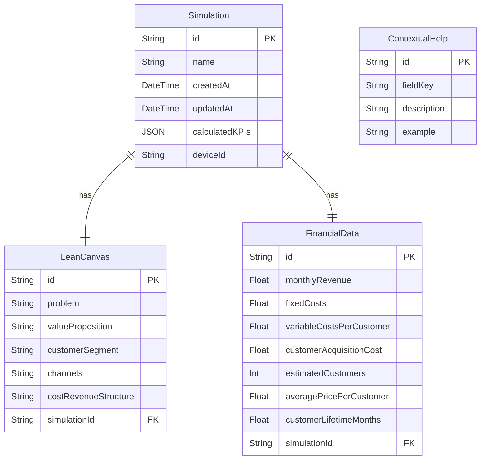

# Modelo de Datos - LeanSim

## Descripción

Este modelo de datos representa las entidades principales necesarias para implementar la aplicación LeanSim, sus atributos y las relaciones entre ellas. El diseño está optimizado para soportar todas las funcionalidades del MVP mientras se mantiene la simplicidad necesaria para un desarrollo ágil.

## Decisiones de Diseño

- Se ha diseñado un modelo centrado en la entidad `Simulation` que agrupa los distintos componentes de una simulación.
- Se han separado los datos del Lean Canvas de los datos financieros para permitir flexibilidad en el futuro pero manteniendo la relación necesaria.
- Los datos históricos se almacenan como parte integral del modelo para facilitar la recuperación de simulaciones pasadas.
- Se han incluido elementos para manejar las ayudas contextuales como parte del sistema.
- Se ha optado por un modelo que sea implementable directamente en Prisma ORM.

## Diagrama

## Elementos Principales

1. **Entidad Simulation**:

   - Representa una simulación completa realizada por el usuario
   - Contiene metadatos como nombre, fechas y un ID de dispositivo para identificar las simulaciones de un mismo usuario sin necesidad de registro
   - Almacena los KPIs calculados como un objeto JSON para flexibilidad y rápido acceso

2. **Entidad LeanCanvas**:

   - Almacena los 5 campos clave del Lean Canvas simplificado
   - Se relaciona directamente con una simulación específica

3. **Entidad FinancialData**:

   - Contiene todos los inputs financieros necesarios para los cálculos
   - Cada registro está vinculado a una simulación específica

4. **Entidad ContextualHelp**:

   - Almacena las ayudas contextuales para cada campo o concepto
   - Contiene descripciones y ejemplos que se mostrarán en tooltips

5. **Relaciones**:
   - Una `Simulation` tiene exactamente un `LeanCanvas` y un conjunto de `FinancialData`
   - La entidad `ContextualHelp` es independiente y se utiliza como referencia para los tooltips y ayudas

## Consideraciones Adicionales

- El modelo está diseñado para ser implementado con Prisma ORM, utilizando SQLite en desarrollo y PostgreSQL en producción.
- Los KPIs calculados se almacenan como JSON para permitir agregar nuevas métricas en el futuro sin cambiar el esquema.
- El `deviceId` permite identificar simulaciones de un mismo usuario sin requerir registro, adecuado para el MVP.
- Para versiones futuras, podría extenderse para incluir un modelo de Usuario y relaciones de pertenencia de simulaciones.
- La entidad `ContextualHelp` podría integrarse con un sistema de gestión de contenidos para facilitar actualizaciones.
