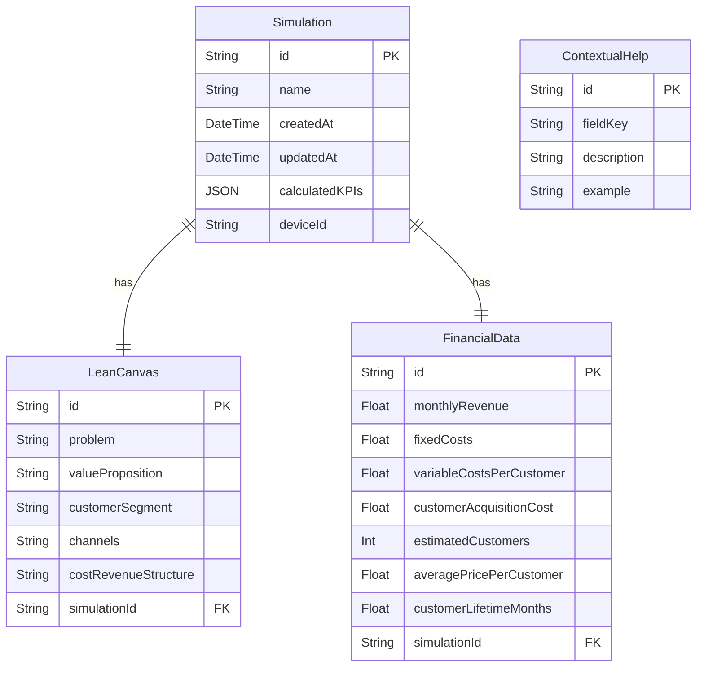

# Modelo de Datos - LeanSim

## Descripción

Este modelo de datos representa las entidades principales necesarias para implementar la aplicación LeanSim, sus atributos y las relaciones entre ellas. El diseño está optimizado para soportar todas las funcionalidades del MVP mientras se mantiene la simplicidad necesaria para un desarrollo ágil.

## Decisiones de Diseño

- Se ha diseñado un modelo centrado en la entidad `Simulation` que agrupa los distintos componentes de una simulación.
- Se han separado los datos del Lean Canvas de los datos financieros para permitir flexibilidad en el futuro pero manteniendo la relación necesaria.
- Los datos históricos se almacenan como parte integral del modelo para facilitar la recuperación de simulaciones pasadas.
- Se han incluido elementos para manejar las ayudas contextuales como parte del sistema.
- Se ha optado por un modelo que sea implementable directamente en Prisma ORM.

## Diagrama

## Elementos Principales

### 1. Entidad Simulation

**Descripción:** Representa una simulación completa realizada por el usuario. Almacena metadatos e identificadores para mantener el historial de simulaciones.

**Atributos:**

- `id` (String): Identificador único de la simulación. **Clave primaria**, generado automáticamente usando CUID.
- `name` (String): Nombre de la simulación. **Not null**, permite al usuario identificar cada simulación.
- `createdAt` (DateTime): Fecha y hora de creación. **Not null**, valor por defecto: fecha/hora actual.
- `updatedAt` (DateTime): Fecha y hora de la última actualización. **Not null**, se actualiza automáticamente.
- `calculatedKPIs` (JSON): Almacena los resultados calculados de KPIs financieros. **Nullable**, permite flexibilidad en el formato de datos.
- `deviceId` (String): Identificador del dispositivo que creó la simulación. **Not null**, permite identificar simulaciones del mismo usuario sin login.

**Relaciones:**

- Relación 1:1 con `LeanCanvas` (tiene un canvas)
- Relación 1:1 con `FinancialData` (tiene un conjunto de datos financieros)

**Restricciones:**

- La entidad debe tener un nombre válido
- El ID debe ser único en toda la base de datos
- Se eliminan en cascada `LeanCanvas` y `FinancialData` al eliminar una simulación

### 2. Entidad LeanCanvas

**Descripción:** Almacena los 5 campos clave del Lean Canvas simplificado que definen la estrategia del negocio.

**Atributos:**

- `id` (String): Identificador único del Lean Canvas. **Clave primaria**, generado automáticamente usando CUID.
- `problem` (String): Descripción del problema que resuelve el negocio. **Not null**.
- `valueProposition` (String): Propuesta de valor única del negocio. **Not null**.
- `customerSegment` (String): Segmento de clientes al que se dirige el negocio. **Not null**.
- `channels` (String): Canales de distribución y comunicación. **Not null**.
- `costRevenueStructure` (String): Estructura de costes e ingresos. **Not null**.
- `simulationId` (String): Referencia a la simulación a la que pertenece. **Clave foránea y unique**.

**Relaciones:**

- Relación 1:1 con `Simulation` (pertenece a una simulación)

**Restricciones:**

- Todos los campos son obligatorios
- Un canvas solo puede pertenecer a una simulación
- El `simulationId` debe ser único (relación 1:1)
- Se elimina en cascada cuando se elimina la simulación asociada (`onDelete: Cascade`)

### 3. Entidad FinancialData

**Descripción:** Contiene todos los inputs financieros necesarios para realizar los cálculos de KPIs y evaluar la viabilidad económica del negocio.

**Atributos:**

- `id` (String): Identificador único de los datos financieros. **Clave primaria**, generado automáticamente usando CUID.
- `monthlyRevenue` (Float): Ingresos mensuales estimados. **Not null**, debe ser mayor o igual a 0.
- `fixedCosts` (Float): Costes fijos mensuales. **Not null**, debe ser mayor o igual a 0.
- `variableCostsPerCustomer` (Float): Costes variables por cliente. **Not null**, debe ser mayor o igual a 0.
- `customerAcquisitionCost` (Float): Coste de adquisición de clientes (CAC). **Not null**, debe ser mayor o igual a 0.
- `estimatedCustomers` (Int): Número estimado de clientes. **Not null**, debe ser entero positivo.
- `averagePricePerCustomer` (Float): Precio medio por cliente. **Not null**, debe ser mayor que 0.
- `customerLifetimeMonths` (Float): Duración media del cliente en meses. **Not null**, debe ser mayor que 0.
- `simulationId` (String): Referencia a la simulación a la que pertenece. **Clave foránea y unique**.

**Relaciones:**

- Relación 1:1 con `Simulation` (pertenece a una simulación)

**Restricciones:**

- Todos los campos son obligatorios
- Los valores numéricos deben cumplir con restricciones de rango específicas
- Los datos financieros solo pueden pertenecer a una simulación
- El `simulationId` debe ser único (relación 1:1)
- Se elimina en cascada cuando se elimina la simulación asociada (`onDelete: Cascade`)

### 4. Entidad ContextualHelp

**Descripción:** Almacena las ayudas contextuales para cada campo o concepto de la aplicación, proporcionando soporte educativo a los usuarios.

**Atributos:**

- `id` (String): Identificador único de la ayuda contextual. **Clave primaria**, generado automáticamente usando CUID.
- `fieldKey` (String): Clave única que identifica el campo al que pertenece la ayuda. **Not null y unique**.
- `description` (String): Descripción explicativa del campo o concepto. **Not null**.
- `example` (String): Ejemplo que ilustra el uso o significado del campo. **Not null**.

**Relaciones:**

- Sin relaciones directas (entidad de referencia)

**Restricciones:**

- Todos los campos son obligatorios
- El campo `fieldKey` debe ser único en toda la tabla para permitir búsquedas rápidas

## Consideraciones Adicionales

- El modelo está diseñado para ser implementado con Prisma ORM, utilizando SQLite en desarrollo y PostgreSQL en producción.
- Los KPIs calculados se almacenan como JSON para permitir agregar nuevas métricas en el futuro sin cambiar el esquema.
- El `deviceId` permite identificar simulaciones de un mismo usuario sin requerir registro, adecuado para el MVP.
- Para versiones futuras, podría extenderse para incluir un modelo de Usuario y relaciones de pertenencia de simulaciones.
- La entidad `ContextualHelp` podría integrarse con un sistema de gestión de contenidos para facilitar actualizaciones.
