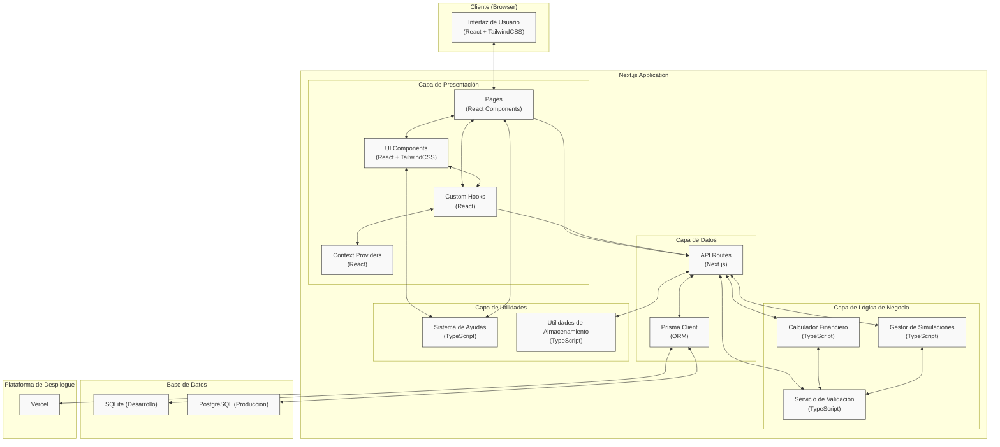

# Arquitectura de Alto Nivel - LeanSim

## Descripción

Este diagrama representa la arquitectura de alto nivel propuesta para la aplicación LeanSim, mostrando los componentes principales, las capas de la aplicación, el flujo de datos entre componentes y las tecnologías utilizadas en cada uno.

## Decisiones de Diseño

- Se ha elegido una arquitectura basada en Next.js que aprovecha sus capacidades fullstack para simplicidad del desarrollo MVP.
- La arquitectura sigue un patrón de capas que separa claramente las responsabilidades de UI, lógica de negocio y persistencia.
- Se ha evitado la sobreingeniería, manteniendo un enfoque pragmático y orientado a la entrega rápida del MVP.
- El diseño respeta los principios SOLID, KISS, DRY y YAGNI:
  - **SOLID**: Las responsabilidades están bien separadas (UI/Lógica/Datos).
  - **KISS**: La arquitectura es simple y directa, sin componentes innecesarios.
  - **DRY**: Se promueve la reutilización de componentes y lógica de negocio.
  - **YAGNI**: Solo se incluyen los componentes necesarios para el MVP.

## Diagrama

## Elementos Principales

1. **Capa de Presentación**:

   - **Pages**: Componentes de página de Next.js que definen las rutas de la aplicación.
   - **UI Components**: Componentes reutilizables para construir la interfaz (formularios, tarjetas, etc.).
   - **Custom Hooks**: Lógica reutilizable para gestión de estado y efectos secundarios.
   - **Context Providers**: Proveedores de contexto para compartir estado global.

2. **Capa de Lógica de Negocio**:

   - **Calculador Financiero**: Implementa las fórmulas para calcular KPIs financieros.
   - **Servicio de Validación**: Valida los inputs del usuario antes de procesarlos.
   - **Gestor de Simulaciones**: Maneja las operaciones CRUD de las simulaciones.

3. **Capa de Datos**:

   - **API Routes**: Endpoints de API de Next.js para operaciones CRUD.
   - **Prisma Client**: ORM para interactuar con la base de datos.

4. **Capa de Utilidades**:

   - **Sistema de Ayudas**: Gestiona las ayudas contextuales y tooltips.
   - **Utilidades de Almacenamiento**: Funciones para interactuar con localStorage y persistencia.

5. **Base de Datos**:

   - **SQLite**: Para desarrollo local.
   - **PostgreSQL**: Para el entorno de producción.

6. **Plataforma de Despliegue**:
   - **Vercel**: Plataforma para el despliegue de la aplicación Next.js.

## Consideraciones Adicionales

- Esta arquitectura prioriza la simplicidad y rapidez de desarrollo, adecuada para un MVP.
- El uso de Next.js permite una experiencia de desarrollo integrada sin necesidad de mantener repositorios separados para frontend y backend.
- La separación en capas facilita las futuras expansiones sin alterar la estructura fundamental.
- El sistema está diseñado para ser desplegable en Vercel con mínima configuración.
- Las operaciones de cálculo financiero se realizan en el servidor para proteger la lógica de negocio.
- No se incluye autenticación de usuarios en esta fase, utilizando identificadores de dispositivo para las simulaciones.
