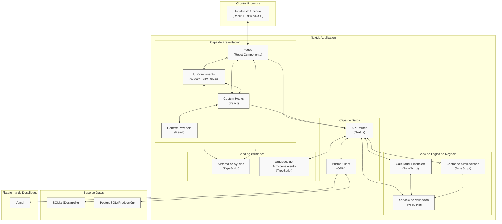
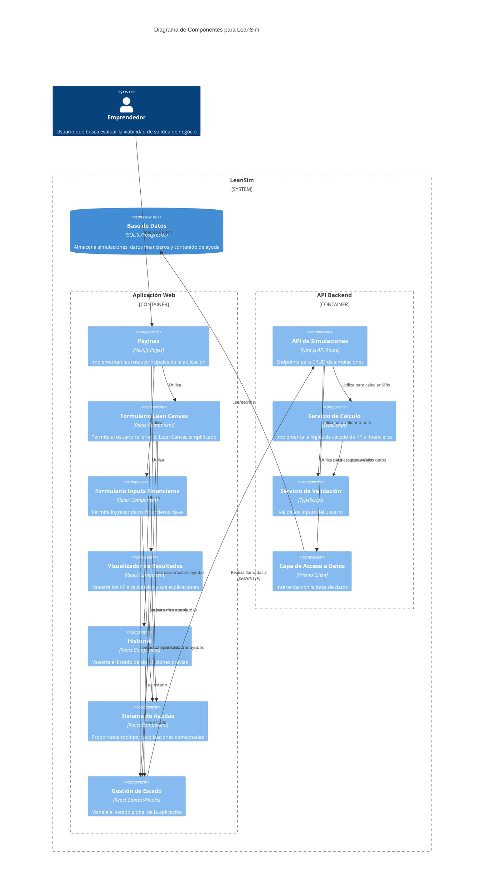
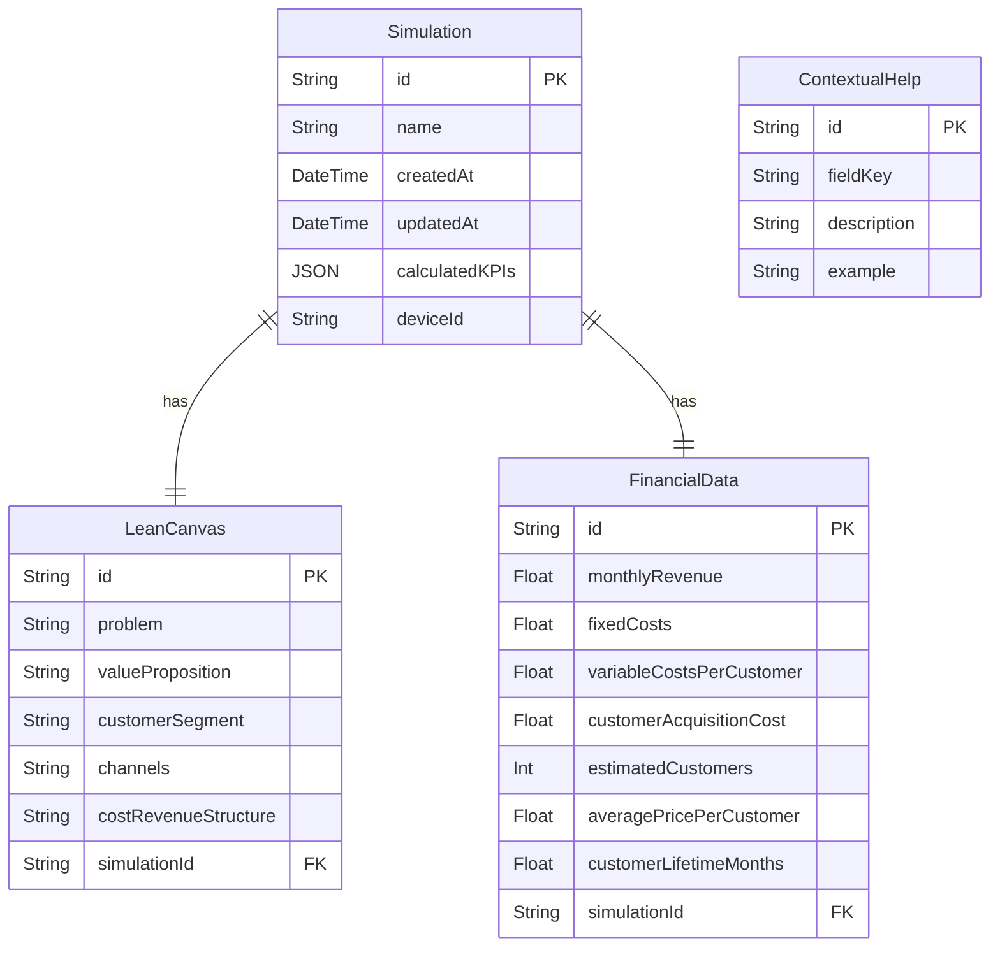

## Índice

0. [Ficha del proyecto](#0-ficha-del-proyecto)
1. [Descripción general del producto](#1-descripción-general-del-producto)
2. [Arquitectura del sistema](#2-arquitectura-del-sistema)
3. [Modelo de datos](#3-modelo-de-datos)
4. [Especificación de la API](#4-especificación-de-la-api)
5. [Historias de usuario](#5-historias-de-usuario)
6. [Tickets de trabajo](#6-tickets-de-trabajo)
7. [Pull requests](#7-pull-requests)

---

## 0. Ficha del proyecto

### **0.1. Tu nombre completo:**

Javier Sanz Benede

### **0.2. Nombre del proyecto:**

LeanSim

### **0.3. Descripción breve del proyecto:**

**LeanSim** es una herramienta web para emprendedores que permite simular la viabilidad financiera de su idea de negocio en minutos, sin necesidad de conocimientos técnicos o financieros. Combina una visión estratégica (mini-Lean Canvas) con el cálculo automático de KPIs clave, en un entorno educativo y accesible.

### **0.4. URL del proyecto:**

> Puede ser pública o privada, en cuyo caso deberás compartir los accesos de manera segura. Puedes enviarlos a [alvaro@lidr.co](mailto:alvaro@lidr.co) usando algún servicio como [onetimesecret](https://onetimesecret.com/).

### 0.5. URL o archivo comprimido del repositorio

https://github.com/javiSBP/leansim

---

## 1. Descripción general del producto

### **1.1. Objetivo:**

**LeanSim** es una herramienta web que permite a emprendedores simular la viabilidad básica de su modelo de negocio sin conocimientos financieros.  
El objetivo del MVP es permitir que el usuario:

- Complete una versión simplificada del Lean Canvas.
- Ingrese datos clave sobre su modelo financiero.
- Visualice automáticamente métricas esenciales como beneficio mensual, CAC, LTV y punto de equilibrio.
- Aprenda durante el proceso con ayudas contextuales.

### **1.2. Características y funcionalidades principales:**

| Función                          | Descripción                                          |
| -------------------------------- | ---------------------------------------------------- |
| Lean Canvas simplificado         | 5 campos clave con ayudas contextuales.              |
| Formulario de inputs financieros | Ingresos, costes, CAC, nº clientes, duración media.  |
| Cálculo de KPIs                  | Beneficio, punto de equilibrio, LTV, CAC, margen.    |
| Visualización de resultados      | Tarjetas o tabla + texto explicativo corto.          |
| Historial de simulaciones        | Guardado local o en base de datos.                   |
| Tooltips educativos              | Breves descripciones accesibles en todos los campos. |

### **1.3. Diseño y experiencia de usuario:**

> Proporciona imágenes y/o videotutorial mostrando la experiencia del usuario desde que aterriza en la aplicación, pasando por todas las funcionalidades principales.

### **1.4. Instrucciones de instalación:**

> Documenta de manera precisa las instrucciones para instalar y poner en marcha el proyecto en local (librerías, backend, frontend, servidor, base de datos, migraciones y semillas de datos, etc.)

---

## 2. Arquitectura del Sistema

### **2.1. Diagrama de arquitectura:**

# Arquitectura de Alto Nivel - LeanSim

## Descripción

Este diagrama representa la arquitectura de alto nivel propuesta para la aplicación LeanSim, mostrando los componentes principales, las capas de la aplicación, el flujo de datos entre componentes y las tecnologías utilizadas en cada uno.

## Decisiones de Diseño

- Se ha elegido una arquitectura basada en Next.js que aprovecha sus capacidades fullstack para simplicidad del desarrollo MVP.
- La arquitectura sigue un patrón de capas que separa claramente las responsabilidades de UI, lógica de negocio y persistencia.
- Se ha evitado la sobreingeniería, manteniendo un enfoque pragmático y orientado a la entrega rápida del MVP.
- El diseño respeta los principios SOLID, KISS, DRY y YAGNI:
  - **SOLID**: Las responsabilidades están bien separadas (UI/Lógica/Datos).
  - **KISS**: La arquitectura es simple y directa, sin componentes innecesarios.
  - **DRY**: Se promueve la reutilización de componentes y lógica de negocio.
  - **YAGNI**: Solo se incluyen los componentes necesarios para el MVP.

## Diagrama



## Elementos Principales

1. **Capa de Presentación**:

   - **Pages**: Componentes de página de Next.js que definen las rutas de la aplicación.
   - **UI Components**: Componentes reutilizables para construir la interfaz (formularios, tarjetas, etc.).
   - **Custom Hooks**: Lógica reutilizable para gestión de estado y efectos secundarios.
   - **Context Providers**: Proveedores de contexto para compartir estado global.

2. **Capa de Lógica de Negocio**:

   - **Calculador Financiero**: Implementa las fórmulas para calcular KPIs financieros.
   - **Servicio de Validación**: Valida los inputs del usuario antes de procesarlos.
   - **Gestor de Simulaciones**: Maneja las operaciones CRUD de las simulaciones.

3. **Capa de Datos**:

   - **API Routes**: Endpoints de API de Next.js para operaciones CRUD.
   - **Prisma Client**: ORM para interactuar con la base de datos.

4. **Capa de Utilidades**:

   - **Sistema de Ayudas**: Gestiona las ayudas contextuales y tooltips.
   - **Utilidades de Almacenamiento**: Funciones para interactuar con localStorage y persistencia.

5. **Base de Datos**:

   - **SQLite**: Para desarrollo local.
   - **PostgreSQL**: Para el entorno de producción.

6. **Plataforma de Despliegue**:
   - **Vercel**: Plataforma para el despliegue de la aplicación Next.js.

## Consideraciones Adicionales

- Esta arquitectura prioriza la simplicidad y rapidez de desarrollo, adecuada para un MVP.
- El uso de Next.js permite una experiencia de desarrollo integrada sin necesidad de mantener repositorios separados para frontend y backend.
- La separación en capas facilita las futuras expansiones sin alterar la estructura fundamental.
- El sistema está diseñado para ser desplegable en Vercel con mínima configuración.
- Las operaciones de cálculo financiero se realizan en el servidor para proteger la lógica de negocio.
- No se incluye autenticación de usuarios en esta fase, utilizando identificadores de dispositivo para las simulaciones.

### Patrones y Arquitectura

La estructura del proyecto sigue varios patrones de diseño y convenciones:

1. **Arquitectura por capas**: La organización de carpetas refleja la separación de responsabilidades en capas (presentación, lógica de negocio, datos y utilidades).

2. **File-based Routing**: Se utiliza el sistema de enrutamiento basado en archivos de Next.js, donde la estructura de carpetas en `app/` define automáticamente las rutas de la aplicación.

3. **Feature-based Organization**: Los componentes están organizados por funcionalidad o característica (lean-canvas, financial-form, results) en lugar de por tipo, facilitando la localización y mantenimiento del código.

4. **Dependency Injection**: Se utilizan contextos de React para proporcionar servicios y estado a los componentes que los necesitan, permitiendo un acoplamiento débil entre componentes.

5. **Repository Pattern**: La capa de datos utiliza Prisma Client como una implementación del patrón repositorio, abstrayendo las operaciones de la base de datos.

6. **Service Pattern**: La lógica de negocio está encapsulada en servicios especializados (FinancialCalculator, ValidationService, SimulationManager).

Esta estructura facilita:

- La **escalabilidad** del proyecto a medida que crezca
- La **mantenibilidad** al tener una clara separación de responsabilidades
- El **testeo** al permitir probar cada capa de forma aislada
- La **colaboración** entre desarrolladores al tener una organización clara y predecible

### **2.2. Descripción de componentes principales:**



- **Componentes de UI**:

  - **Páginas (Pages)**: Componentes de nivel superior que definen las rutas de la aplicación. Gestionan la composición general de cada vista y el flujo de navegación.
  - **Formulario Lean Canvas**: Componente especializado para capturar los 5 campos clave del Lean Canvas simplificado, con validación integrada y ayudas contextuales.
  - **Formulario de Inputs Financieros**: Componente para la entrada de datos financieros con validación en tiempo real, tooltips explicativos y formateo automático.
  - **Visualizador de Resultados**: Componente que muestra los KPIs calculados con representaciones visuales, codificación por colores e información contextual.
  - **Historial de Simulaciones**: Componente que lista las simulaciones previas, permitiendo cargarlas o eliminarlas.
  - **Componentes UI Base**: Biblioteca de componentes reutilizables como botones, inputs, tarjetas y modales que mantienen una experiencia consistente.

- **Gestión de Estado**:

  - **Context Providers**: Implementan el patrón de Context API de React para proporcionar estado global a diferentes partes de la aplicación.
  - **Custom Hooks**: Encapsulan lógica reutilizable para gestionar efectos secundarios, llamadas a API y manipulación de estado local.
  - **Form State Management**: Utiliza React Hook Form para la gestión eficiente del estado de formularios complejos, validación y manejo de errores.

- **APIs y Servicios**:
  - **API de Simulaciones**: Endpoints para crear, recuperar, actualizar y eliminar simulaciones completas.
  - **Servicio de Cálculo Financiero**: Implementa los algoritmos y fórmulas para calcular todos los KPIs financieros basados en los inputs del usuario.
  - **Servicio de Validación**: Valida todos los inputs del usuario según reglas de negocio específicas antes de procesarlos.
  - **Acceso a Datos**: Capa que abstrae las operaciones de base de datos mediante Prisma Client, implementando el patrón repositorio.
  - **Sistema de Ayudas Contextuales**: Servicio que gestiona y proporciona contenido educativo contextual para cada campo y concepto.

### **2.3. Descripción de alto nivel del proyecto y estructura de ficheros**

La estructura de ficheros del proyecto LeanSim sigue las convenciones de Next.js con una organización adicional que refleja la arquitectura por capas descrita anteriormente. A continuación se detalla la estructura principal de carpetas:

```
leansim/
├── src/                      # Carpeta opcional que contiene el código fuente principal
│   ├── app/                  # App Router de Next.js (rutas y páginas basadas en archivos)
│   │   ├── api/              # API Routes para operaciones del backend
│   │   ├── (routes)/         # Rutas de la aplicación organizadas por funcionalidad
│   │   ├── layout.tsx        # Layout principal compartido por todas las páginas
│   │   └── page.tsx          # Página principal (Home)
│   ├── components/           # Componentes de UI reutilizables
│   │   ├── lean-canvas/      # Componentes específicos del Lean Canvas
│   │   ├── financial-form/   # Formularios de datos financieros
│   │   ├── results/          # Visualización de resultados y KPIs
│   │   ├── ui/               # Componentes de UI genéricos (botones, inputs, etc.)
│   │   └── layout/           # Componentes estructurales (headers, footers, etc.)
│   ├── hooks/                # Hooks personalizados para gestión de estado y efectos
│   ├── context/              # Contextos de React para estado global
│   ├── lib/                  # Código compartido y utilidades
│   │   ├── financial/        # Calculador financiero y lógica de negocio
│   │   ├── validation/       # Servicios de validación
│   │   ├── simulation/       # Gestor de simulaciones
│   │   └── helpers/          # Funciones auxiliares
│   ├── types/                # Definiciones de TypeScript
│   └── utils/                # Utilidades generales
│       ├── help-system/      # Sistema de ayudas contextuales
│       └── storage/          # Utilidades de almacenamiento
├── prisma/                   # Configuración de Prisma ORM
│   ├── schema.prisma         # Modelo de datos
│   └── migrations/           # Migraciones de la base de datos
├── public/                   # Archivos estáticos (imágenes, favicon, etc.)
├── next.config.js            # Configuración de Next.js
├── tailwind.config.js        # Configuración de TailwindCSS
├── tsconfig.json             # Configuración de TypeScript
└── package.json              # Dependencias y scripts
```

### **2.4. Infraestructura y despliegue**


# Infraestructura de Despliegue - LeanSim

## Descripción General

Este documento describe la infraestructura de despliegue de LeanSim, una aplicación Next.js alojada en la plataforma Vercel. La arquitectura está diseñada para proporcionar una experiencia de usuario óptima con rendimiento de carga rápido, mientras mantiene un flujo de desarrollo y despliegue eficiente.

## Diagrama de Infraestructura


## Componentes Principales

### 1. Repositorio GitHub y CI/CD

- **Repositorio GitHub**: Almacena el código fuente de la aplicación con control de versiones.
- **Pipeline CI/CD**: Automatiza los procesos de integración y despliegue continuo.
- **Push/PR**: El flujo comienza cuando los desarrolladores envían código (push) o crean solicitudes de cambios (pull requests).
- **Despliegue y Migraciones Prisma**: Durante el despliegue, se ejecutan automáticamente las migraciones de base de datos utilizando Prisma.

### 2. Plataforma Vercel

- **CDN de Vercel**: Distribuye contenido estático y dinámico a través de una red global de servidores.
- **Cache y Contenido Dinámico**: Almacena en caché los recursos estáticos mientras sirve eficientemente el contenido dinámico.

### 3. Edge Network

- **Server-Side Rendering (SSR)**: Genera las páginas HTML en el servidor para una carga inicial más rápida y mejor SEO.
- **Edge Functions**: Ejecuta código en ubicaciones cercanas al usuario para reducir la latencia.
- **Optimización de Imágenes**: Procesa y sirve imágenes optimizadas para diferentes dispositivos y anchos de banda.
- **Middleware/Optimización en el Edge**: Intercepta y modifica solicitudes en la capa edge para mejorar el rendimiento.

### 4. API Routes

- **API Interna**: Endpoints para operaciones CRUD y lógica de negocio.
- **Prisma Client**: ORM que facilita la comunicación con la base de datos de manera segura y tipada.

### 5. Base de Datos PostgreSQL

- **PostgreSQL**: Sistema de gestión de bases de datos relacional utilizado en producción.
- **Consultas SQL**: Gestionadas y optimizadas a través de Prisma Client.

## Flujo de Datos y Solicitudes

1. **Desarrollo y Despliegue**:

   - Los desarrolladores envían código al repositorio GitHub
   - El pipeline CI/CD se activa automáticamente
   - Vercel despliega la aplicación y ejecuta las migraciones de Prisma

2. **Flujo de Solicitudes del Usuario**:

   - El navegador web envía una solicitud HTTP al CDN de Vercel
   - El contenido estático se sirve desde el CDN
   - Las peticiones dinámicas se procesan a través del Server-Side Rendering
   - Las imágenes se optimizan automáticamente según las necesidades

3. **Procesamiento de Datos**:
   - Las API Routes manejan operaciones que requieren acceso a datos
   - Prisma Client traduce las operaciones a consultas SQL optimizadas
   - La base de datos PostgreSQL procesa las consultas y devuelve los resultados

## Ventajas de esta Arquitectura

- **Despliegue Continuo**: Actualización automática de la aplicación con cada push al repositorio
- **Escalabilidad**: La infraestructura de Vercel escala automáticamente según la demanda
- **Rendimiento Global**: La red edge distribuida garantiza baja latencia para usuarios en cualquier ubicación
- **Seguridad**: Las credenciales de base de datos y secretos se gestionan de forma segura a través de variables de entorno en Vercel
- **Productividad**: Los desarrolladores pueden centrarse en el código y las características, no en la gestión de infraestructura
- **Preview Deployments**: Cada pull request genera un despliegue de vista previa para facilitar las pruebas

## Configuración y Gestión

La configuración de la infraestructura se gestiona principalmente a través de los siguientes archivos:

- `next.config.js`: Configuración específica de Next.js
- `vercel.json`: Configuración específica de Vercel (redirecciones, headers, etc.)
- `schema.prisma`: Definición del modelo de datos y conexión a la base de datos
- `.env.production`: Variables de entorno para el entorno de producción
- `.github/workflows`: Configuración adicional de CI/CD si se requiere

### **2.5. Seguridad**

> Enumera y describe las prácticas de seguridad principales que se han implementado en el proyecto, añadiendo ejemplos si procede

### **2.6. Tests**

> Describe brevemente algunos de los tests realizados

---

## 3. Modelo de Datos

### **3.1. Diagrama del modelo de datos:**



### **3.2. Descripción de entidades principales:**

### 1. Entidad Simulation

**Descripción:** Representa una simulación completa realizada por el usuario. Almacena metadatos e identificadores para mantener el historial de simulaciones.

**Atributos:**

- `id` (String): Identificador único de la simulación. **Clave primaria**, generado automáticamente usando CUID.
- `name` (String): Nombre de la simulación. **Not null**, permite al usuario identificar cada simulación.
- `createdAt` (DateTime): Fecha y hora de creación. **Not null**, valor por defecto: fecha/hora actual.
- `updatedAt` (DateTime): Fecha y hora de la última actualización. **Not null**, se actualiza automáticamente.
- `calculatedKPIs` (JSON): Almacena los resultados calculados de KPIs financieros. **Nullable**, permite flexibilidad en el formato de datos.
- `deviceId` (String): Identificador del dispositivo que creó la simulación. **Not null**, permite identificar simulaciones del mismo usuario sin login.

**Relaciones:**

- Relación 1:1 con `LeanCanvas` (tiene un canvas)
- Relación 1:1 con `FinancialData` (tiene un conjunto de datos financieros)

**Restricciones:**

- La entidad debe tener un nombre válido
- El ID debe ser único en toda la base de datos
- Se eliminan en cascada `LeanCanvas` y `FinancialData` al eliminar una simulación

### 2. Entidad LeanCanvas

**Descripción:** Almacena los 5 campos clave del Lean Canvas simplificado que definen la estrategia del negocio.

**Atributos:**

- `id` (String): Identificador único del Lean Canvas. **Clave primaria**, generado automáticamente usando CUID.
- `problem` (String): Descripción del problema que resuelve el negocio. **Not null**.
- `valueProposition` (String): Propuesta de valor única del negocio. **Not null**.
- `customerSegment` (String): Segmento de clientes al que se dirige el negocio. **Not null**.
- `channels` (String): Canales de distribución y comunicación. **Not null**.
- `costRevenueStructure` (String): Estructura de costes e ingresos. **Not null**.
- `simulationId` (String): Referencia a la simulación a la que pertenece. **Clave foránea y unique**.

**Relaciones:**

- Relación 1:1 con `Simulation` (pertenece a una simulación)

**Restricciones:**

- Todos los campos son obligatorios
- Un canvas solo puede pertenecer a una simulación
- El `simulationId` debe ser único (relación 1:1)
- Se elimina en cascada cuando se elimina la simulación asociada (`onDelete: Cascade`)

### 3. Entidad FinancialData

**Descripción:** Contiene todos los inputs financieros necesarios para realizar los cálculos de KPIs y evaluar la viabilidad económica del negocio.

**Atributos:**

- `id` (String): Identificador único de los datos financieros. **Clave primaria**, generado automáticamente usando CUID.
- `monthlyRevenue` (Float): Ingresos mensuales estimados. **Not null**, debe ser mayor o igual a 0.
- `fixedCosts` (Float): Costes fijos mensuales. **Not null**, debe ser mayor o igual a 0.
- `variableCostsPerCustomer` (Float): Costes variables por cliente. **Not null**, debe ser mayor o igual a 0.
- `customerAcquisitionCost` (Float): Coste de adquisición de clientes (CAC). **Not null**, debe ser mayor o igual a 0.
- `estimatedCustomers` (Int): Número estimado de clientes. **Not null**, debe ser entero positivo.
- `averagePricePerCustomer` (Float): Precio medio por cliente. **Not null**, debe ser mayor que 0.
- `customerLifetimeMonths` (Float): Duración media del cliente en meses. **Not null**, debe ser mayor que 0.
- `simulationId` (String): Referencia a la simulación a la que pertenece. **Clave foránea y unique**.

**Relaciones:**

- Relación 1:1 con `Simulation` (pertenece a una simulación)

**Restricciones:**

- Todos los campos son obligatorios
- Los valores numéricos deben cumplir con restricciones de rango específicas
- Los datos financieros solo pueden pertenecer a una simulación
- El `simulationId` debe ser único (relación 1:1)
- Se elimina en cascada cuando se elimina la simulación asociada (`onDelete: Cascade`)

### 4. Entidad ContextualHelp

**Descripción:** Almacena las ayudas contextuales para cada campo o concepto de la aplicación, proporcionando soporte educativo a los usuarios.

**Atributos:**

- `id` (String): Identificador único de la ayuda contextual. **Clave primaria**, generado automáticamente usando CUID.
- `fieldKey` (String): Clave única que identifica el campo al que pertenece la ayuda. **Not null y unique**.
- `description` (String): Descripción explicativa del campo o concepto. **Not null**.
- `example` (String): Ejemplo que ilustra el uso o significado del campo. **Not null**.

**Relaciones:**

- Sin relaciones directas (entidad de referencia)

**Restricciones:**

- Todos los campos son obligatorios
- El campo `fieldKey` debe ser único en toda la tabla para permitir búsquedas rápidas

---

## 4. Especificación de la API

> Si tu backend se comunica a través de API, describe los endpoints principales (máximo 3) en formato OpenAPI. Opcionalmente puedes añadir un ejemplo de petición y de respuesta para mayor claridad

---

## 5. Historias de Usuario

**Historia de Usuario 1**

# Historia de Usuario: Completar Lean Canvas Simplificado

**Como** emprendedor,
**quiero** rellenar un Lean Canvas básico de forma guiada,
**para** estructurar mi idea de negocio de manera estratégica.

## Descripción

Como emprendedor necesito una forma sencilla de estructurar mi idea de negocio siguiendo el marco del Lean Canvas, pero de manera simplificada con solo 5 campos esenciales. Quiero poder completar estos campos con ayudas que me expliquen qué debo incluir en cada uno, ya que no tengo experiencia previa con herramientas de planificación de negocios.

## Criterios de Aceptación

- El formulario debe contener los 5 campos clave: Problema, Propuesta de Valor, Segmento de Clientes, Canales, y Estructura de ingresos/costes
- Cada campo debe tener un tooltip o ayuda contextual que explique qué información debe incluirse
- El formulario debe validar que todos los campos estén completos antes de avanzar
- El usuario debe poder navegar entre los campos y modificarlos fácilmente
- Los datos ingresados deben guardarse temporalmente para no perderse al navegar entre secciones
- El diseño debe ser intuitivo, con campos claramente etiquetados y espacio suficiente para escribir

## Notas Adicionales

- El diseño debe ser minimalista y amigable para usuarios sin experiencia previa con Lean Canvas
- Considerar agregar ejemplos cortos para cada campo basados en casos reales
- Limitar el texto en cada campo para mantener la simplicidad (máximo 300 caracteres por campo)
- Implementar un indicador visual de progreso para que el usuario sepa en qué parte del proceso está

## Historias de Usuario Relacionadas

- Formulario de inputs financieros
- Sistema de ayudas contextuales

**Historia de Usuario 2**

# Historia de Usuario: Ingresar Datos Financieros Básicos

**Como** usuario sin formación financiera,
**quiero** introducir mis ingresos y costes de forma simple,
**para** evaluar si mi modelo de negocio es rentable.

## Descripción

Como usuario sin conocimientos financieros avanzados, necesito una forma sencilla e intuitiva de ingresar los datos financieros clave de mi negocio. Quiero poder introducir información básica como ingresos mensuales, costes fijos, costes variables, el coste de adquisición de clientes, número estimado de clientes y duración media de la relación con ellos. Necesito que el proceso sea guiado y comprensible para alguien sin formación especializada.

## Criterios de Aceptación

- El formulario debe incluir campos para: ingresos mensuales estimados, costes fijos, costes variables por cliente, CAC, número estimado de clientes, precio medio por cliente y duración media del cliente
- Cada campo debe tener validación adecuada (no permitir valores negativos, formato numérico correcto)
- Los campos deben tener valores por defecto o ejemplos para orientar al usuario
- El formulario debe permitir guardar los datos parcialmente completados
- El usuario debe poder volver atrás para modificar información sin perder los datos ya ingresados
- Debe haber un botón claro para calcular los resultados una vez completados todos los campos requeridos

## Notas Adicionales

- Utilizar un lenguaje sencillo y no técnico en todas las etiquetas y explicaciones
- Incluir ayudas visuales como iconos o mini-gráficos junto a cada campo para facilitar la comprensión
- Considerar usar elementos interactivos como sliders para facilitar la entrada de algunos valores
- Mantener el formulario visualmente simple para no abrumar al usuario
- Mostrar un indicador de progreso para que el usuario sepa en qué punto del proceso se encuentra

## Historias de Usuario Relacionadas

- Completar Lean Canvas Simplificado
- Cálculo y visualización de KPIs
- Sistema de ayudas contextuales

**Historia de Usuario 3**

# Historia de Usuario: Visualizar Métricas de Viabilidad

**Como** emprendedor,
**quiero** ver automáticamente las métricas clave de mi negocio,
**para** entender la viabilidad financiera de mi idea sin necesidad de cálculos manuales.

## Descripción

Como emprendedor sin experiencia en análisis financiero, necesito que el sistema calcule y me muestre de forma clara las métricas clave para evaluar la viabilidad de mi modelo de negocio. Quiero ver indicadores como el beneficio mensual, punto de equilibrio, valor del ciclo de vida del cliente (LTV), relación LTV/CAC y margen por cliente, basados en los datos financieros que he ingresado previamente. Necesito entender estos valores con explicaciones sencillas para tomar decisiones informadas.

## Criterios de Aceptación

- El sistema debe calcular automáticamente: beneficio mensual, punto de equilibrio, LTV, relación LTV/CAC y margen por cliente
- Los resultados deben presentarse en tarjetas o paneles visuales claramente diferenciados
- Cada métrica debe mostrarse con una breve explicación en lenguaje sencillo de lo que significa
- Los valores críticos deben destacarse visualmente (ej. margen negativo en rojo)
- Debe haber indicadores visuales de "salud" para cada métrica (bueno/medio/malo)
- El usuario debe poder ver una explicación más detallada de cada métrica al hacer clic o pasar el cursor sobre ella
- Debe haber opciones para compartir o guardar los resultados

## Notas Adicionales

- Usar visualizaciones simples como códigos de color, iconos o mini-gráficos para facilitar la comprensión
- Evitar jerga financiera compleja en las explicaciones principales
- Considerar incluir recomendaciones básicas basadas en los resultados (ej. "Tu CAC es demasiado alto en comparación con el LTV")
- Mantener una estética limpia y no abrumadora, priorizando la claridad sobre la densidad de información
- Proporcionar opciones para ver los resultados en diferentes formatos (tarjetas, tabla, gráfico)

## Historias de Usuario Relacionadas

- Ingresar Datos Financieros Básicos
- Historial de simulaciones
- Sistema de ayudas contextuales

---

## 6. Tickets de Trabajo

> Documenta 3 de los tickets de trabajo principales del desarrollo, uno de backend, uno de frontend, y uno de bases de datos. Da todo el detalle requerido para desarrollar la tarea de inicio a fin teniendo en cuenta las buenas prácticas al respecto.

**Ticket 1**

**Ticket 2**

**Ticket 3**

---

## 7. Pull Requests

> Documenta 3 de las Pull Requests realizadas durante la ejecución del proyecto

**Pull Request 1**

**Pull Request 2**

**Pull Request 3**
