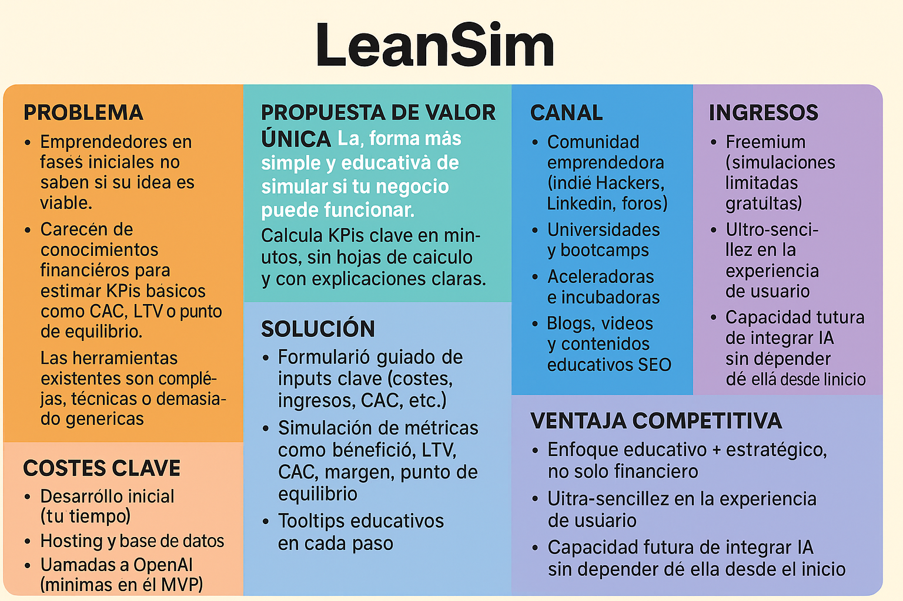

# 🧠 LEAN CANVAS – LeanSim

| Bloque                          | Contenido                                                                                                                                                                                                                                                      |
| ------------------------------- | -------------------------------------------------------------------------------------------------------------------------------------------------------------------------------------------------------------------------------------------------------------- |
| **1. Problema**                 | - Emprendedores en fases iniciales no saben si su idea es viable.   - Carecen de conocimientos financieros para estimar KPIs básicos como CAC, LTV o punto de equilibrio.   - Las herramientas existentes son complejas, técnicas o demasiado genéricas. |
| **2. Segmentos de cliente**     | - Emprendedores primerizos   - Estudiantes de máster o bootcamps de negocio/startups   - Freelancers que quieren probar modelos de negocio   - Incubadoras o aceleradoras que necesitan herramientas para sus cohortes                                |
| **3. Propuesta de valor única** | _La forma más simple y educativa de simular si tu negocio puede funcionar._   Calcula KPIs clave en minutos, sin hojas de cálculo y con explicaciones claras.                                                                                               |
| **4. Solución**                 | - Formulario guiado de inputs clave (costes, ingresos, CAC, etc.)   - Simulación de métricas como beneficio, LTV, CAC, margen, punto de equilibrio   - Mini-Lean Canvas integrado   - Tooltips educativos en cada paso                                |
| **5. Canales**                  | - Comunidad emprendedora (Indie Hackers, LinkedIn, foros)   - Universidades y bootcamps   - Aceleradoras e incubadoras   - Blogs, vídeos y contenidos educativos SEO                                                                                  |
| **6. Ingresos**                 | - Freemium (simulaciones limitadas gratuitas)   - Suscripción mensual con más simulaciones, exportación PDF, IA asistente, métricas avanzadas                                                                                                               |
| **7. Costes clave**             | - Desarrollo inicial (tu tiempo)   - Hosting y base de datos   - Llamadas a OpenAI (mínimas en el MVP)   - Dominio, diseño, si se desea                                                                                                               |
| **8. Métricas clave**           | - Nº de simulaciones completadas   - Nº de usuarios registrados / recurrentes   - Feedback de utilidad (NPS, encuestas rápidas)   - Tasa de conversión a pago                                                                                         |
| **9. Ventaja competitiva**      | - Enfoque educativo + estratégico, no solo financiero   - Ultra-sencillez en la experiencia de usuario   - Capacidad futura de integrar IA sin depender de ella desde el inicio                                                                          |

