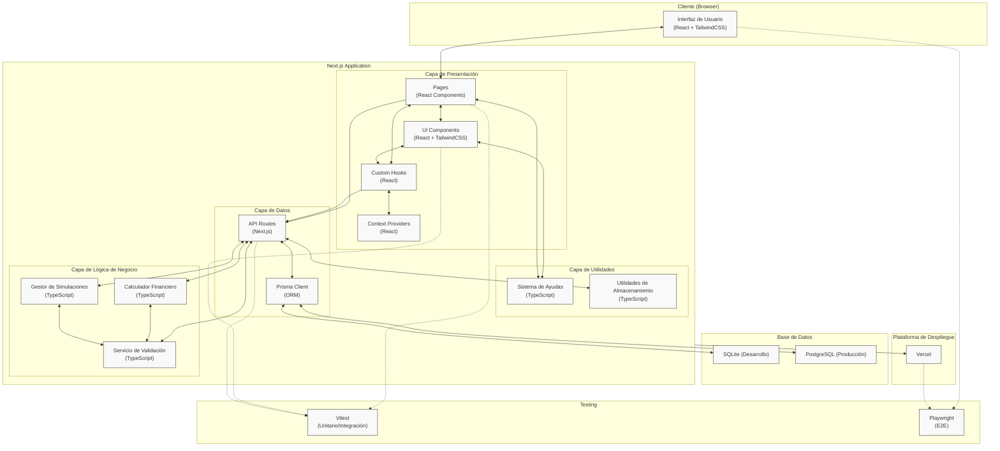

# Arquitectura de Alto Nivel - LeanSim

## Descripción

Este diagrama representa la arquitectura de alto nivel propuesta para la aplicación LeanSim, mostrando los componentes principales, las capas de la aplicación, el flujo de datos entre componentes y las tecnologías utilizadas en cada uno.

**Stack tecnológico principal:**

- **Next.js** (Fullstack framework)
- **React** (UI)
- **TypeScript** (Tipado estático)
- **TailwindCSS** (Estilos)
- **Prisma ORM** (Acceso a datos)
- **SQLite/PostgreSQL** (Bases de datos)
- **Vercel** (Despliegue)
- **Vitest** (Testing unitario e integración)
- **Playwright** (Testing end-to-end/E2E)

## Decisiones de Diseño

- Se ha elegido una arquitectura basada en Next.js que aprovecha sus capacidades fullstack para simplicidad del desarrollo MVP.
- La arquitectura sigue un patrón de capas que separa claramente las responsabilidades de UI, lógica de negocio y persistencia.
- Se ha evitado la sobreingeniería, manteniendo un enfoque pragmático y orientado a la entrega rápida del MVP.
- El diseño respeta los principios SOLID, KISS, DRY y YAGNI:
  - **SOLID**: Las responsabilidades están bien separadas (UI/Lógica/Datos).
  - **KISS**: La arquitectura es simple y directa, sin componentes innecesarios.
  - **DRY**: Se promueve la reutilización de componentes y lógica de negocio.
  - **YAGNI**: Solo se incluyen los componentes necesarios para el MVP.

## Diagrama



## Elementos Principales

1. **Capa de Presentación**:

   - **Pages**: Componentes de página de Next.js que definen las rutas de la aplicación.
   - **UI Components**: Componentes reutilizables para construir la interfaz (formularios, tarjetas, etc.).
   - **Custom Hooks**: Lógica reutilizable para gestión de estado y efectos secundarios.
   - **Context Providers**: Proveedores de contexto para compartir estado global.

2. **Capa de Lógica de Negocio**:

   - **Calculador Financiero**: Implementa las fórmulas para calcular KPIs financieros.
   - **Servicio de Validación**: Valida los inputs del usuario antes de procesarlos.
   - **Gestor de Simulaciones**: Maneja las operaciones CRUD de las simulaciones.

3. **Capa de Datos**:

   - **API Routes**: Endpoints de API de Next.js para operaciones CRUD.
   - **Prisma Client**: ORM para interactuar con la base de datos.

4. **Capa de Utilidades**:

   - **Sistema de Ayudas**: Gestiona las ayudas contextuales y tooltips.
   - **Utilidades de Almacenamiento**: Funciones para interactuar con localStorage y persistencia.

5. **Base de Datos**:

   - **SQLite**: Para desarrollo local.
   - **PostgreSQL**: Para el entorno de producción.

6. **Plataforma de Despliegue**:
   - **Vercel**: Plataforma para el despliegue de la aplicación Next.js.

## Consideraciones Adicionales

- Esta arquitectura prioriza la simplicidad y rapidez de desarrollo, adecuada para un MVP.
- El uso de Next.js permite una experiencia de desarrollo integrada sin necesidad de mantener repositorios separados para frontend y backend.
- La separación en capas facilita las futuras expansiones sin alterar la estructura fundamental.
- El sistema está diseñado para ser desplegable en Vercel con mínima configuración.
- Las operaciones de cálculo financiero se realizan en el servidor para proteger la lógica de negocio.
- No se incluye autenticación de usuarios en esta fase, utilizando identificadores de dispositivo para las simulaciones.

### Testing

- **Vitest** se utiliza para pruebas unitarias y de integración de lógica de negocio, hooks y componentes React. Permite un desarrollo rápido y feedback inmediato.
- **Playwright** se emplea para pruebas end-to-end (E2E), validando flujos completos de usuario y accesibilidad en navegadores reales.
- Ambos frameworks son compatibles con Next.js y recomendados para stacks modernos.
- Se recomienda usar [@testing-library/react](https://testing-library.com/docs/react-testing-library/intro/) junto con Vitest para pruebas de componentes.

#### Referencias

- [Vitest + Next.js (guía oficial)](https://vitest.dev/guide/#next-js)
- [Playwright + Next.js (guía oficial)](https://playwright.dev/docs/test-intro)

## Estructura del Proyecto

La estructura de ficheros del proyecto LeanSim sigue las convenciones de Next.js con una organización adicional que refleja la arquitectura por capas descrita anteriormente. A continuación se detalla la estructura principal de carpetas:

```
leansim/
├── src/                      # Carpeta opcional que contiene el código fuente principal
│   ├── app/                  # App Router de Next.js (rutas y páginas basadas en archivos)
│   │   ├── api/              # API Routes para operaciones del backend
│   │   ├── (routes)/         # Rutas de la aplicación organizadas por funcionalidad
│   │   ├── layout.tsx        # Layout principal compartido por todas las páginas
│   │   └── page.tsx          # Página principal (Home)
│   ├── components/           # Componentes de UI reutilizables
│   │   ├── lean-canvas/      # Componentes específicos del Lean Canvas
│   │   ├── financial-form/   # Formularios de datos financieros
│   │   ├── results/          # Visualización de resultados y KPIs
│   │   ├── ui/               # Componentes de UI genéricos (botones, inputs, etc.)
│   │   └── layout/           # Componentes estructurales (headers, footers, etc.)
│   ├── hooks/                # Hooks personalizados para gestión de estado y efectos
│   ├── context/              # Contextos de React para estado global
│   ├── lib/                  # Código compartido y utilidades
│   │   ├── financial/        # Calculador financiero y lógica de negocio
│   │   ├── validation/       # Servicios de validación
│   │   ├── simulation/       # Gestor de simulaciones
│   │   └── helpers/          # Funciones auxiliares
│   ├── types/                # Definiciones de TypeScript
│   └── utils/                # Utilidades generales
│       ├── help-system/      # Sistema de ayudas contextuales
│       └── storage/          # Utilidades de almacenamiento
├── prisma/                   # Configuración de Prisma ORM
│   ├── schema.prisma         # Modelo de datos
│   └── migrations/           # Migraciones de la base de datos
├── public/                   # Archivos estáticos (imágenes, favicon, etc.)
├── next.config.js            # Configuración de Next.js
├── tailwind.config.js        # Configuración de TailwindCSS
├── tsconfig.json             # Configuración de TypeScript
└── package.json              # Dependencias y scripts
```

### Patrones y Arquitectura

La estructura del proyecto sigue varios patrones de diseño y convenciones:

1. **Arquitectura por capas**: La organización de carpetas refleja la separación de responsabilidades en capas (presentación, lógica de negocio, datos y utilidades).

2. **File-based Routing**: Se utiliza el sistema de enrutamiento basado en archivos de Next.js, donde la estructura de carpetas en `app/` define automáticamente las rutas de la aplicación.

3. **Feature-based Organization**: Los componentes están organizados por funcionalidad o característica (lean-canvas, financial-form, results) en lugar de por tipo, facilitando la localización y mantenimiento del código.

4. **Dependency Injection**: Se utilizan contextos de React para proporcionar servicios y estado a los componentes que los necesitan, permitiendo un acoplamiento débil entre componentes.

5. **Repository Pattern**: La capa de datos utiliza Prisma Client como una implementación del patrón repositorio, abstrayendo las operaciones de la base de datos.

6. **Service Pattern**: La lógica de negocio está encapsulada en servicios especializados (FinancialCalculator, ValidationService, SimulationManager).

Esta estructura facilita:

- La **escalabilidad** del proyecto a medida que crezca
- La **mantenibilidad** al tener una clara separación de responsabilidades
- El **testeo** al permitir probar cada capa de forma aislada
- La **colaboración** entre desarrolladores al tener una organización clara y predecible
