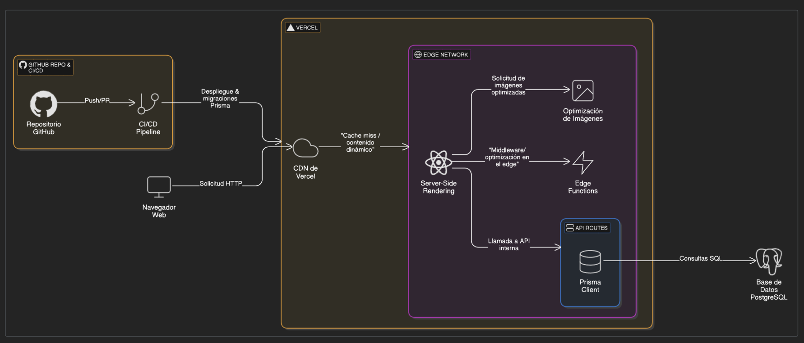

# Infraestructura de Despliegue - LeanSim

## Descripción General

Este documento describe la infraestructura de despliegue de LeanSim, una aplicación Next.js alojada en la plataforma Vercel. La arquitectura está diseñada para proporcionar una experiencia de usuario óptima con rendimiento de carga rápido, mientras mantiene un flujo de desarrollo y despliegue eficiente.

## Diagrama de Infraestructura

## Componentes Principales

### 1. Repositorio GitHub y CI/CD

- **Repositorio GitHub**: Almacena el código fuente de la aplicación con control de versiones.
- **Pipeline CI/CD**: Automatiza los procesos de integración y despliegue continuo.
- **Push/PR**: El flujo comienza cuando los desarrolladores envían código (push) o crean solicitudes de cambios (pull requests).
- **Despliegue y Migraciones Prisma**: Durante el despliegue, se ejecutan automáticamente las migraciones de base de datos utilizando Prisma.

### 2. Plataforma Vercel

- **CDN de Vercel**: Distribuye contenido estático y dinámico a través de una red global de servidores.
- **Cache y Contenido Dinámico**: Almacena en caché los recursos estáticos mientras sirve eficientemente el contenido dinámico.

### 3. Edge Network

- **Server-Side Rendering (SSR)**: Genera las páginas HTML en el servidor para una carga inicial más rápida y mejor SEO.
- **Edge Functions**: Ejecuta código en ubicaciones cercanas al usuario para reducir la latencia.
- **Optimización de Imágenes**: Procesa y sirve imágenes optimizadas para diferentes dispositivos y anchos de banda.
- **Middleware/Optimización en el Edge**: Intercepta y modifica solicitudes en la capa edge para mejorar el rendimiento.

### 4. API Routes

- **API Interna**: Endpoints para operaciones CRUD y lógica de negocio.
- **Prisma Client**: ORM que facilita la comunicación con la base de datos de manera segura y tipada.

### 5. Base de Datos PostgreSQL

- **PostgreSQL**: Sistema de gestión de bases de datos relacional utilizado en producción.
- **Consultas SQL**: Gestionadas y optimizadas a través de Prisma Client.

## Flujo de Datos y Solicitudes

1. **Desarrollo y Despliegue**:

   - Los desarrolladores envían código al repositorio GitHub
   - El pipeline CI/CD se activa automáticamente
   - Vercel despliega la aplicación y ejecuta las migraciones de Prisma

2. **Flujo de Solicitudes del Usuario**:

   - El navegador web envía una solicitud HTTP al CDN de Vercel
   - El contenido estático se sirve desde el CDN
   - Las peticiones dinámicas se procesan a través del Server-Side Rendering
   - Las imágenes se optimizan automáticamente según las necesidades

3. **Procesamiento de Datos**:
   - Las API Routes manejan operaciones que requieren acceso a datos
   - Prisma Client traduce las operaciones a consultas SQL optimizadas
   - La base de datos PostgreSQL procesa las consultas y devuelve los resultados

## Ventajas de esta Arquitectura

- **Despliegue Continuo**: Actualización automática de la aplicación con cada push al repositorio
- **Escalabilidad**: La infraestructura de Vercel escala automáticamente según la demanda
- **Rendimiento Global**: La red edge distribuida garantiza baja latencia para usuarios en cualquier ubicación
- **Seguridad**: Las credenciales de base de datos y secretos se gestionan de forma segura a través de variables de entorno en Vercel
- **Productividad**: Los desarrolladores pueden centrarse en el código y las características, no en la gestión de infraestructura
- **Preview Deployments**: Cada pull request genera un despliegue de vista previa para facilitar las pruebas

## Configuración y Gestión

La configuración de la infraestructura se gestiona principalmente a través de los siguientes archivos:

- `next.config.js`: Configuración específica de Next.js
- `vercel.json`: Configuración específica de Vercel (redirecciones, headers, etc.)
- `schema.prisma`: Definición del modelo de datos y conexión a la base de datos
- `.env.production`: Variables de entorno para el entorno de producción
- `.github/workflows`: Configuración adicional de CI/CD si se requiere
